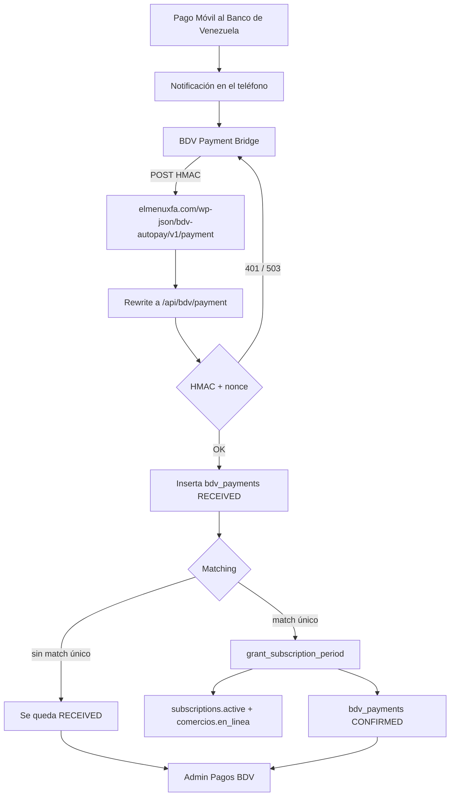

# Pago Móvil BDV — guía de soporte técnico

Documento operativo del receptor de **BDV Payment Bridge** en ElMenúXFA. Sirve para diagnosticar por qué un Pago Móvil no activó el menú y qué hacer en el panel **Admin → Pagos BDV**.

El APK de BDV Payment Bridge **no se modifica**. El teléfono solo notifica; ElMenúXFA decide si activa la suscripción.

---

## 1. Arquitectura



Componentes:

| Pieza | Dónde vive | Rol |
|---|---|---|
| BDV Payment Bridge | App Android en el teléfono | Lee la notificación del banco, firma HMAC y reenvía el pago. Cola persistente con reintentos. |
| Receptor Next.js | Proyecto Vercel `kosmenu` (site) | Valida HMAC, guarda el pago, intenta matching y activa. |
| Rewrite WP | `site/next.config.mjs` | El APK llama `wp-json/bdv-autopay/v1/*` (ruta de WordPress). Eso se reescribe a `/api/bdv/*`. |
| Supabase prod | `qqhberaayhohxlbbhdyi` | Tablas BDV, órdenes pendientes, suscripciones. |
| Panel admin | `https://admin.elmenuxfa.com/admin/pagos-bdv` | Monitoreo, reproceso, asociación manual, rechazo. |

El Bridge considera éxito **cualquier HTTP 2xx**. Un `401` o `503` se reintenta (backoff 10 s → 30 min, indefinido).

URL que debe tener el teléfono:

```
https://elmenuxfa.com/
```

El APK añade solo el path. Si la URL apunta a otro dominio (por ejemplo cineahorro), ElMenúXFA nunca ve el pago.

Endpoints públicos:

| Método | URL | Uso |
|---|---|---|
| POST | `/wp-json/bdv-autopay/v1/ping` | “Probar conexión” del Bridge |
| POST | `/wp-json/bdv-autopay/v1/payment` | Pago real (rewrite) |
| POST | `/api/bdv/payment` | Mismo handler, ruta nativa |
| POST | `/api/bdv/test-payment` | Simulación firmada HMAC (no es un agujero abierto) |
| GET | cualquiera de las anteriores | `405` (solo POST) |

Cabeceras HMAC (obligatorias):

- `X-BDV-Device`
- `X-BDV-Timestamp` (epoch segundos, holgura ±300 s)
- `X-BDV-Nonce` (un solo uso)
- `X-BDV-Signature` = hex(`HMAC-SHA256(secret, timestamp + "\n" + nonce + "\n" + rawBody)`)

---

## 2. Tablas usadas

Migración: `supabase/migrations/20260916180000_bdv_pago_movil_receiver.sql`.

RLS: `anon` y `authenticated` no leen estas tablas. Solo `service_role` (API del site y admin).

### `bdv_payments`

Un row por notificación del Bridge. Clave de idempotencia: `payment_id` (único).

Campos que mira soporte:

| Columna | Significado |
|---|---|
| `payment_id` | Id que manda el Bridge. En pruebas: `bdv-test-…` |
| `amount` | Monto en bolívares |
| `reference` / `operation_number` | Referencia BDV |
| `sender_phone` / `sender_name` | Emisor |
| `raw_text` | Texto crudo de la notificación |
| `status` | `RECEIVED` / `CONFIRMED` / `REJECTED` |
| `match_reason` | `reference`, `amount_phone`, `amount`, `admin_assign`, o nota de rechazo |
| `matched_business_id` | Comercio activado |
| `matched_order_id` | Orden `bdv_checkout_orders` |
| `matched_submission_id` | Solicitud manual `payment_submissions` |
| `payload` | JSON original, se usa al **Reprocesar** |
| `device_id` | Teléfono/dispositivo del Bridge |

### `bdv_checkout_orders`

Orden pendiente de cobro. Como máximo **una** `PENDING_PAYMENT` por comercio.

Se crea de dos formas:

1. El comerciante abre un Pago Móvil en la app → `payment_submissions` (`method_code = pago_movil`, `status = pending`) → trigger `sync_bdv_checkout_order_from_submission`.
2. Un admin crea la orden en **Pagos BDV**.

`expected_amount_ves` = `amount_usd *` última tasa BCV de `global_market_rates`. El teléfono esperado sale de `comercios.whatsapp` o `comercios.telefonos`.

### `bdv_nonces`

Anti-replay. Un nonce HMAC no se puede reutilizar. Duplicado → `401`.

### `payment_events`

Inbox de eventos. El receptor BDV escribe con `provider = bdv_pago_movil`. No confundir con webhooks de Zeno (`provider = zeno`).

Tipos que verá soporte en el detalle del pago:

| `event_type` | Qué ocurrió |
|---|---|
| `hmac_validated` | Firma correcta |
| `hmac_rejected` | Firma, timestamp o nonce malos |
| `payment_received` | Guardado en `bdv_payments` |
| `matching_found` / `matching_missed` | Resultado del matching |
| `activation_completed` / `activation_failed` | `grant_subscription_period` |
| `admin_reprocess` / `admin_assign` / `admin_reject` | Acciones del panel |
| `error` | JSON inválido u otro fallo de ingest |

Los pagos anteriores a este logging pueden no tener historial.

### Tablas de billing que toca la activación

| Tabla | Efecto |
|---|---|
| `subscriptions` | `status = active`, se extiende `current_period_end` |
| `payments` | Ledger. `order_id = 'bdv:' \|\| payment_id` (único; un replay no duplica meses) |
| `comercios` | `en_linea = true` |
| `payment_submissions` | Si había solicitud pendiente, pasa a `approved` |
| `plans` | Plan usado: `menu_monthly` (USD 10 / mes) |
| `global_market_rates` | Tasa BCV para el monto esperado en Bs |

`admin_audit_logs` guarda quién asoció o rechazó en el panel.

---

## 3. Estados

### En `bdv_payments` (lo que realmente se guarda)

| Estado | Significado | El menú quedó activo |
|---|---|---|
| `RECEIVED` | Llegó, se guardó, **no** hay match único (o el grant aún no corrió) | No |
| `CONFIRMED` | Matching + `grant_subscription_period` OK | Sí |
| `REJECTED` | Un admin lo marcó inválido | No |

El flujo automático es solo `RECEIVED` → `CONFIRMED`. No hay estado intermedio persistido.

### En el filtro del panel (también aparecen)

| Estado en UI | Cómo interpretarlo |
|---|---|
| `MATCHED` | Filtro: `RECEIVED` con `match_reason` no nulo (caso raro; el happy path confirma al instante) |
| `ERROR` | Filtro / eventos. Un 500 de ingest suele dejar el row en `RECEIVED` y un evento `error` o `activation_failed` |

### Órdenes (`bdv_checkout_orders.status`)

`PENDING_PAYMENT` → `PAID` al confirmar. También `EXPIRED` / `CANCELLED` si la solicitud manual se cancela o rechaza.

---

## 4. Matching

Se ejecuta **después** de insertar `RECEIVED`. No activa si hay ambigüedad (0 o 2+ candidatos).

Candidatos:

1. Órdenes `bdv_checkout_orders` en `PENDING_PAYMENT`.
2. `payment_submissions` `pago_movil` + `pending` cuyo comercio no tenga ya una orden BDV pendiente.

Prioridad (la primera que deje **exactamente un** candidato gana):

1. **Referencia** — `reference` o `operation_number` del pago vs `reference` de la orden. Si hay ≥6 dígitos, se comparan solo dígitos; si no, mayúsculas.
2. **Monto + teléfono** — Bs dentro de tolerancia **y** mismo teléfono (últimos 10 dígitos; quita `58` / `0`).
3. **Solo monto** — un único pendiente con ese Bs. Peligroso si dos comercios esperan el mismo monto.

Tolerancia de monto:

```
abs(recibido - esperado) <= max(2, esperado * 0.02)
```

Ejemplo: esperado Bs. 2.000 → acepta ±40. Esperado Bs. 50 → acepta ±2.

`match_reason` queda `reference`, `amount_phone` o `amount`. Asociación desde admin: `admin_assign`.

Si no hay match: el pago **no se pierde**. Queda `RECEIVED` para reprocesar o asociar a mano.

---

## 5. Variables de entorno

Vercel, proyecto `kosmenu`, environment **Production** (el Bridge pega a `elmenuxfa.com`).

| Variable | Obligatoria | Efecto si falta o está mal |
|---|---|---|
| `BDV_SHARED_SECRET` | Sí | POST sin secreto en Vercel → **503** `BDV_SHARED_SECRET is not configured.` Secreto distinto al del teléfono → **401** `Unauthorized` |
| `BDV_HMAC_MAX_SKEW_SECONDS` | No (default 300) | Reloj del teléfono muy desfasado → 401 |
| `NEXT_PUBLIC_SUPABASE_URL` | Sí (ya existía) | 500 al guardar |
| `SUPABASE_SERVICE_ROLE_KEY` | Sí (ya existía) | 500 al guardar |

El valor de `BDV_SHARED_SECRET` tiene que ser **el mismo** en Vercel Production y en la pantalla “secreto” del Bridge. No va en el repo.

Comprobar sin filtrar el secreto:

- POST a `/api/bdv/ping` **sin** cabeceras HMAC → `401` = el secreto está cargado.
- El mismo POST → `503` = no está en Vercel o el deploy no lo tomó (hace falta redeploy después de crearla).

También usa el site (no específicas de BDV): `NEXT_PUBLIC_SUPABASE_ANON_KEY`, URLs de admin/público. Checklist: `site/ADMIN_DEPLOY_CHECKLIST.md`.

---

## 6. Proceso de activación

Solo corre si el matching (o un admin) elige un comercio. No usar `approve_manual_payment` sobre un pago BDV: duplicaría el mes.

Pasos internos:

1. `grant_subscription_period` con:
   - `p_provider = 'bdv_pago_movil'`
   - `p_order_id = 'bdv:' + payment_id`
   - `p_plan_code` de la orden (normalmente `menu_monthly`)
   - `p_amount` en **USD** (precio del plan × meses), no el monto en Bs
2. Si `payments.order_id` ya existe, el RPC es **idempotente** y no suma otro período.
3. `subscriptions.status = active`; si el período vigente no ha vencido, **extiende** `current_period_end` (no lo reinicia).
4. `comercios.en_linea = true`.
5. Solicitud `pago_movil` pendiente → `approved`.
6. Orden BDV → `PAID`.
7. `bdv_payments` → `CONFIRMED`.

Comprobar que el servicio quedó activo:

```sql
select s.status, s.current_period_end, c.nombre, c.en_linea
from public.subscriptions s
join public.comercios c on c.id = s.business_id
where s.business_id = '<comercio_id>';

select order_id, provider, amount, paid_at
from public.payments
where order_id = 'bdv:<payment_id>';
```

En el panel: estado `CONFIRMED`, restaurante asociado, fecha de activación.

---

## 7. Pagos fallidos — qué hacer

Punto de partida: [admin.elmenuxfa.com/admin/pagos-bdv](https://admin.elmenuxfa.com/admin/pagos-bdv). Permiso: `subscriptions.read` + rol `super_admin`, `finance` o `support`. Sales puede ver, no actuar.

### 7.1 El Bridge dice que no conecta (ping)

| Síntoma | Causa probable | Acción |
|---|---|---|
| HTTP 503 | Falta `BDV_SHARED_SECRET` en Vercel o no se redesplegó | Poner el secreto en Production y **redeploy** |
| HTTP 401 | Secreto distinto, reloj del teléfono ±5 min, o nonce repetido | Copiar el secreto de Vercel al Bridge; revisar fecha/hora del Android |
| Timeout / otro host | URL mal puesta | URL exactamente `https://elmenuxfa.com/` |
| HTTP 405 | Están haciendo GET | El Bridge debe usar POST; si es un curl de prueba, usar POST |

No hace falta un pago real para esto: usar **Probar conexión** en el teléfono.

### 7.2 El comerciante pagó y el menú no se activó

1. Buscar en Pagos BDV por referencia, teléfono o rango de fecha.
2. Leer `raw_text` en el detalle (es la notificación del banco).
3. Seguir la tabla:

| Qué ves | Qué significa | Qué hacer |
|---|---|---|
| No hay row | El Bridge no llegó a ElMenúXFA | Revisar URL/secreto, cola del Bridge, que la notificación sea de BDV Pago Móvil |
| `RECEIVED`, sin restaurante | Llegó; matching no encontró un único pendiente | Crear o completar la orden pendiente (monto/ref/teléfono) y **Reprocesar**. O **Asociar manualmente** a esa orden |
| `RECEIVED` y en eventos `activation_failed` | Hubo match pero falló el grant | Ver el error (`PLAN_NOT_FOUND`, `BUSINESS_NOT_FOUND`, etc.), corregir datos, **Reprocesar** |
| `CONFIRMED` pero el comerciante no ve el menú | Activó otro comercio, o caché de app | Verificar `matched_business_id` / nombre; confirmar `en_linea` y `current_period_end` |
| `REJECTED` | Un admin lo descartó | Si fue un error: **Reprocesar** (vuelve a `RECEIVED` y reintenta matching) |
| Dos comercios con el mismo Bs pendiente | El matching por monto se niega (ambiguo) | Dejar una sola orden, o asociar a mano, o pedir la referencia |

**Reprocesar** vuelve a ejecutar el matching sobre el `payload` guardado. No cobra de nuevo al banco. Un `CONFIRMED` no se reprocesa (idempotente).

**Asociar manualmente** exige una orden `PENDING_PAYMENT`. Activa con `grant_subscription_period` igual que el automático (`match_reason = admin_assign`).

**Rechazar** pide motivo. No usar si el dinero es válido y solo faltaba el match.

### 7.3 El matching activó el comercio equivocado

1. Confirmar en el detalle restaurante + `match_reason`.
2. Si fue `amount` (solo monto), es el caso más frágil: dos pendientes con Bs parecidos.
3. La suscripción **ya está otorgada**. No hay “deshacer mes” en el panel BDV. Corregir en billing/suscripciones y dejar una sola orden pendiente por comercio.
4. Avisar a producto si se repite: no usar matching por monto cuando hay varios pendientes similares.

### 7.4 Pago duplicado

El Bridge puede reenviar. `payment_id` único: el segundo request responde `CONFIRMED`/`RECEIVED` con `idempotent: true` y **no** suma otro mes. El grant también es único por `bdv:<payment_id>`.

### 7.5 Consultas SQL rápidas

```sql
-- Últimos pagos
select created_at, payment_id, amount, reference, sender_phone, status, match_reason, matched_business_id
from public.bdv_payments
order by created_at desc
limit 50;

-- Eventos de un pago
select created_at, event_type, processing_error, payload
from public.payment_events
where provider = 'bdv_pago_movil'
  and payload->>'payment_id' = '<payment_id>'
order by created_at;

-- Pendientes que el matching puede usar
select id, business_id, expected_amount_ves, expected_phone, reference, status
from public.bdv_checkout_orders
where status = 'PENDING_PAYMENT';
```

---

## 8. Checklist de un Pago Móvil real

1. Bridge: URL `https://elmenuxfa.com/`, mismo secreto que Vercel, ping en verde.
2. Hay una orden pendiente (solicitud Pago Móvil en la app, o creada en admin) con Bs / ref / teléfono coherentes.
3. El cliente hace el Pago Móvil a la cuenta BDV del teléfono que corre el Bridge.
4. En **Pagos BDV** aparece el row en segundos (o al reintento de la cola).
5. `CONFIRMED` + comercio en línea. Si queda `RECEIVED`, ir a la sección 7.2.

---

## 9. Código de referencia

| Pieza | Path |
|---|---|
| HMAC | `site/app/api/_lib/bdv-hmac.ts` |
| Matching | `site/app/api/_lib/bdv-match.ts` |
| Ingest + activación | `site/app/api/_lib/bdv-ingest.ts` |
| Eventos | `site/app/api/_lib/bdv-events.ts` |
| POST pago | `site/app/api/bdv/payment/route.ts` |
| Panel | `site/app/admin/_components/AdminBdvPaymentsPanel.tsx` |
| API admin | `site/app/admin/api/billing/bdv/route.ts` |
| Schema | `supabase/migrations/20260916180000_bdv_pago_movil_receiver.sql` |
| Grant | `public.grant_subscription_period` |

El teléfono Bridge (solo lectura, no se cambia) firma y POSTea desde `ApiClient.java` / `PaymentSender.java` hacia `wp-json/bdv-autopay/v1/payment`.
